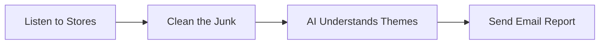

# 🚀 Review Pulse: Your Smart Product Assistant

### **Stop reading thousands of app reviews manually. Let AI do the heavy lifting.**

Imagine you have an app like **Groww** or **Paytm**. Every day, hundreds of users leave reviews. Some are angry, some are happy, and some are just junk. A human would take hours to read them all. 

**Review Pulse** is a smart digital assistant that "reads" every single review for you, understands the main problems, and sends you a professional summary—all in under 5 minutes.

---

## 🌟 What does it do for you?

### 1. 🕵️‍♂️ Finds reviews automatically
It goes to the **Apple App Store** and **Google Play Store** and pulls in the latest user feedback so you don't have to copy-paste anything.

### 2. 🛡️ Protects your privacy
It automatically finds and hides private things like phone numbers and email addresses before anyone sees them.

### 3. 🧹 Cleans out the "junk"
It's smart enough to ignore reviews like "Good" or "Worst app ever" that don't give real feedback. It focuses only on reviews that explain **why** a user is happy or sad.

### 4. 🧠 Understands the "Themes"
It uses AI (like the brain behind ChatGPT) to group reviews. Instead of 1,000 random messages, you get 5 clear topics like:
- "The new login screen is slow"
- "Users love the new Dark Mode"
- "Frequent crashes on Android"

### 5. 📧 Delivers the report to you
Once it's done thinking, it writes a beautiful report and:
- ✍️ Appends it to your **Google Doc**.
- ✉️ Sends an **Email** to your team.

---

## 🖥️ How do I use it?

We've built a **Premium Dashboard** that looks like it's from a sci-fi movie. 

1. **Pick your product** (e.g., Groww).
2. **Click "Initialize Run"**.
3. **Watch the live stream** as the AI works its magic.
4. **Check your inbox** for the final report!

---

## 🛠️ How it works (The Simple Version)

- **The Brain**: We use **Gemini** and **Llama 3** (the world's most powerful AI models) to do the "thinking."
- **The Engine**: Hosted on **Railway.app**, so it runs 24/7 without needing your computer to be on.
- **The Connection**: Uses a special "plug" called **MCP** to safely talk to your Google Docs and Gmail.

---

## 📦 How to get started (For the Tech-Savvy)

1. **API Keys**: You'll need keys from Google AI and Groq Cloud.
2. **Setup**: Install the requirements and run `python main.py --web`.
3. **Go Live**: Push to GitHub and connect to Railway.

---
*Created with ❤️ for Product Managers and Developers.*
